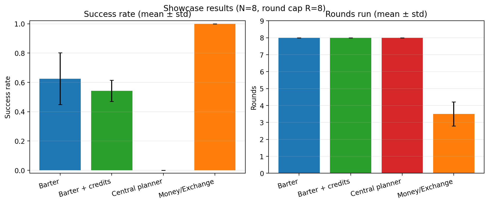

# Agentic economy experiment (barter vs money)

So what: with a fixed per‑agent communication budget, fully bilateral barter scales like ~$N^2$ pairwise search/negotiation, while a hub with a fungible token collapses coordination to ~$N$ hub‑facing interactions and can clear more reliably.

## Core question

In an agentic economy where many LLM agents trade with each other, do we still “need” money (or some hub/hierarchy), or can everyone just negotiate directly via barter?

The thesis we want to test empirically is:

- As the number of agents $N$ grows, the number of potential bilateral negotiations grows roughly like $N^2$.
- Under a fixed communication budget (limited rounds/messages), this bilateral search/negotiation burden makes it hard to clear markets via pure barter.
- Introducing a hub with a token (a money/clearing-house agent) collapses the communication graph into a star: each agent only needs to talk to the hub, and coordination load scales roughly linearly in $N$.

A slightly more formal model and communication‑complexity sketch live in `theory.md`.

## Repo map

- `src/agentic_economy/`: simulator + CLI (`agentic-economy`)
- `runs*/`: raw JSON run logs (gitignored)
- `results/`: generated tables/figures tracked in git ([results/README.md](results/README.md))

## Running

Setup

- Requirements: Python 3.11+, `uv`
- Install deps: `make setup`
- Auth: put `OPENAI_API_KEY=...` in `.env` (loaded via `python-dotenv`)

Quick live smoke test

- `make llm-live`

Run experiments + generate tables

- Explore CLI options: `agentic-economy --help`
- Run a sweep (writes JSON under a gitignored folder):
  - `agentic-economy run --conditions barter money_exchange --n 3 5 8 --seeds 2 --rounds 8 --model gpt-5-mini --output-dir runs_core`
- Generate Markdown/CSV tables from local `runs*/` JSON:
  - `make results-core` / `make results-all` / `make results-pages`

Note: the CLI defaults to `gpt-5-mini` (matching the published tables under `results/`); override with `--model` as needed.

## Experimental setup

### Environment

- Agents: $N$ agents, indexed $A_0, \dots, A_{N-1}$.
- Goods:
  - There are $N$ goods $g_0, \dots, g_{N-1}$.
  - Each agent $A_i$ starts with 1 unit of $g_i$.
  - Each agent wants exactly 1 unit of a different good $g_{\pi(i)}$ (a derangement over goods, so no one wants what they already have).
- Utility: an agent succeeds if it ends the game holding its target good; otherwise, utility 0.
- Time: discrete rounds; each agent can take at most one action per round.
- Observations:
  - Own inventory and target good.
  - A capped window of recent messages sent/received.

All agent decisions are implemented as structured JSON responses from a GPT model via the Responses API.

### Conditions

We run several institutional variants over the *same* agent population and preferences:

1) **Barter (fully bilateral)**: agents negotiate directly with each other; trades require bilateral agreement.

2) **Money/Exchange (hub with a token)**: agents trade only with an Exchange hub using a fungible token and near‑stable posted prices (suggested strategy: sell endowment, buy target).

3) **Central planner / pure hierarchy (local, no token)**: agents report inventory and targets to a planner that can only execute obvious pairwise swaps; it does not solve global cycles.

4) **Barter with credits (experimental)**: barter plus mintable/transferable IOU labels (any non‑`g*` string) that can circulate as tokens.

5) **Barter with chat (experimental)**: like barter, but agents may send short free‑text coordination messages via `send_message` in addition to trade actions.

6) **Barter with chat + credits (experimental)**: chat-enabled barter plus mintable credits (an “emergent money / reputation” probe).

Across conditions in a given run, agents are identical models; only the institution changes.

### Metrics

Per run we track: `success_rate` (agents reaching targets), `rounds_run` (to clear or cap), and basic communication volume (`total_messages`, `unique_pairs`). Money/Exchange runs also log per‑round exchange traffic and price updates.

Run logs include:

- `events`: per‑round instrumentation of raw agent actions (including invalid/hallucinated actions), proposals, trades, credit issuance, and chat messages.
- `behavior_summary`: per‑agent counts of proposals, unique partners, repeated identical proposals, chat messages sent, and invalid actions.

## Results

Curated showcase (see `results/showcase.md` for the canonical version; regenerate with `make results-pages`):

| condition | run_set | runs | success_rate | rounds_run | total_messages | unique_pairs | credit_accepts |
| --- | --- | --- | --- | --- | --- | --- | --- |
| Barter | runs_core | 2 | 0.625 ± 0.177 | 8.00 ± 0.00 | 32.0 ± 4.2 | 9.50 ± 2.12 | 0.00 ± 0.00 |
| Money/Exchange | runs_core | 2 | 1.000 ± 0.000 | 3.50 ± 0.71 | 47.0 ± 1.4 | 8.00 ± 0.00 | 0.00 ± 0.00 |
| Central planner | runs_5mini_full | 1 | 0.000 | 8.00 | 72.0 | 8.00 | 0.00 |
| Barter + credits | runs_5mini_emergent | 3 | 0.542 ± 0.072 | 8.00 ± 0.00 | 34.7 ± 4.2 | 8.67 ± 1.53 | 0.00 ± 0.00 |

More results + regeneration commands:

- Index: [results/README.md](results/README.md)
- One-page views: [results/all_results.md](results/all_results.md), [results/showcase.md](results/showcase.md)
